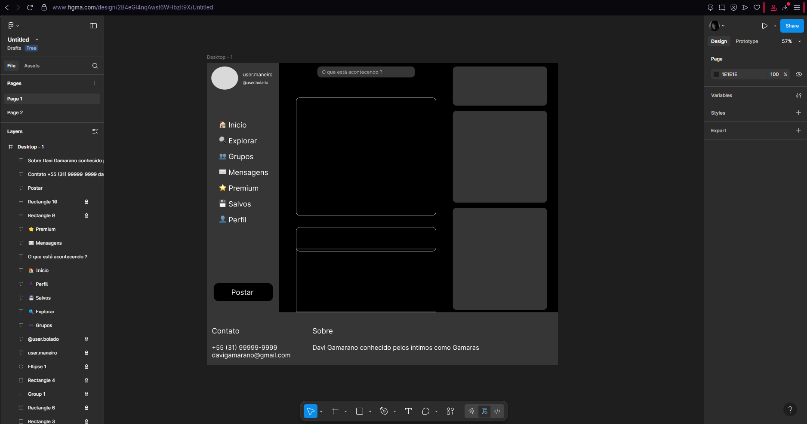
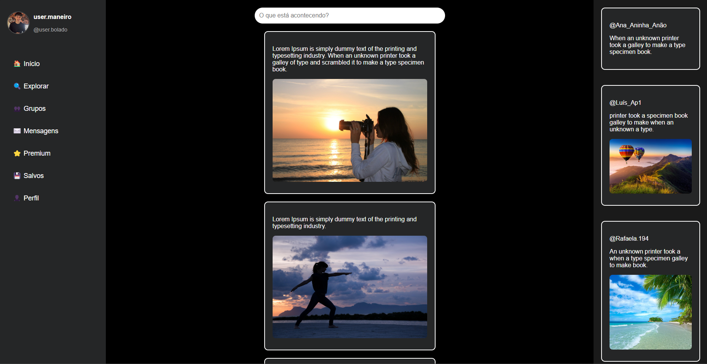
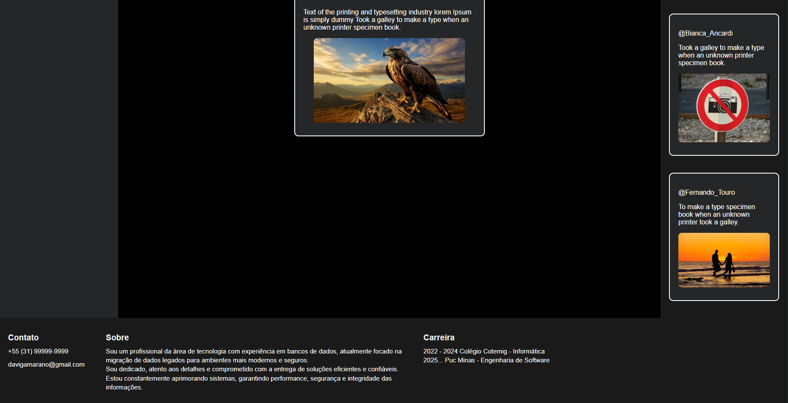

# Trabalho Prático - Semana 03

Dessa vez, vamos escolher uma proposta de projeto para trabalhar.

Nessa atividade, você deverá montar a página inicial do projeto escolhido, a organização do HTML aplicando semântica correta e uso aprimorado do CSS. Leia o enunciado completo no Canvas para mais detalhes.

**IMPORTANTE:** Você deve trabalhar e alterar apenas arquivos dentro da pasta **`public`**. Deixe todos os demais arquivos e pastas desse repositório inalterados. **PRESTE MUITA ATENÇÃO NISSO.**

## Informações Gerais

- Nome: Davi Gamarano Neves Rocha
- Matricula: 902643
- Proposta de projeto escolhida: Página Inicial de uma rede social
- Breve descrição sobre seu projeto: Rede social inspirada no X, contendo uma aba lateral um feed e no canto direito recomendações

## Print do(s) wireframe(s) criado

<<  COLOQUE A IMAGEM AQUI >>

## Print da home-page criada

<<  COLOQUE A IMAGEM AQUI >> --

